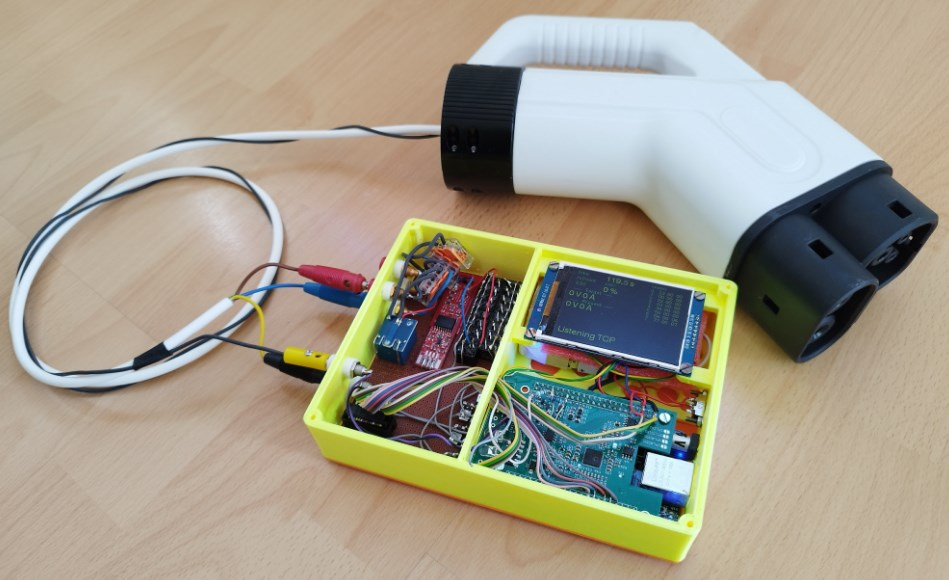
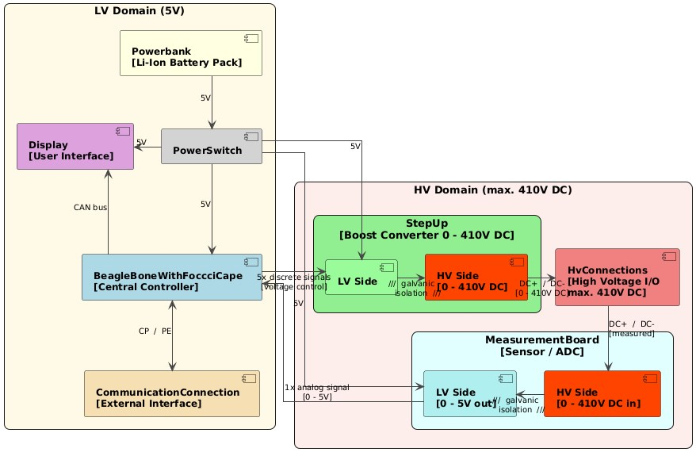
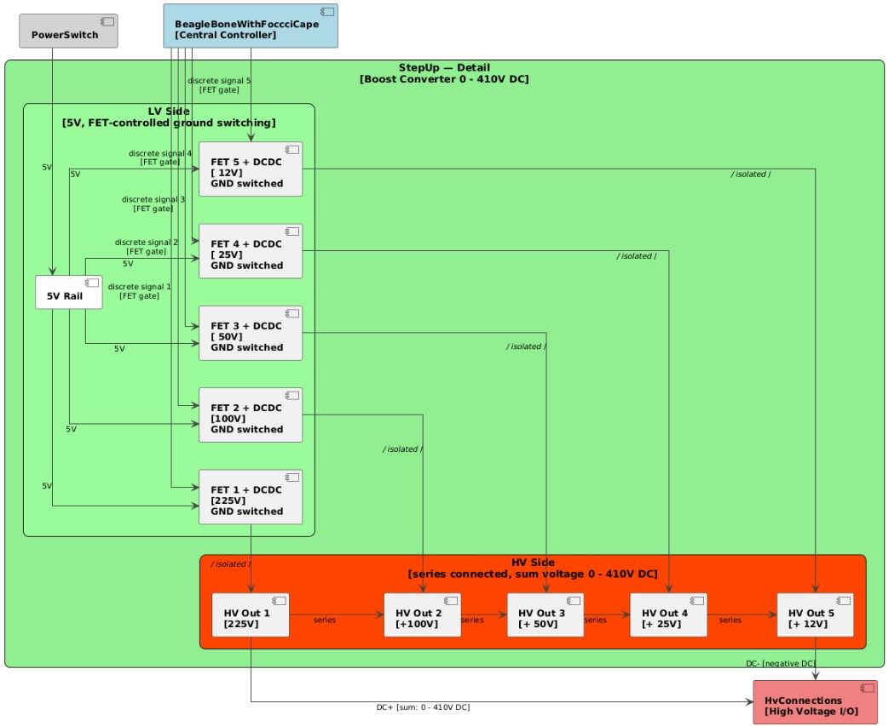
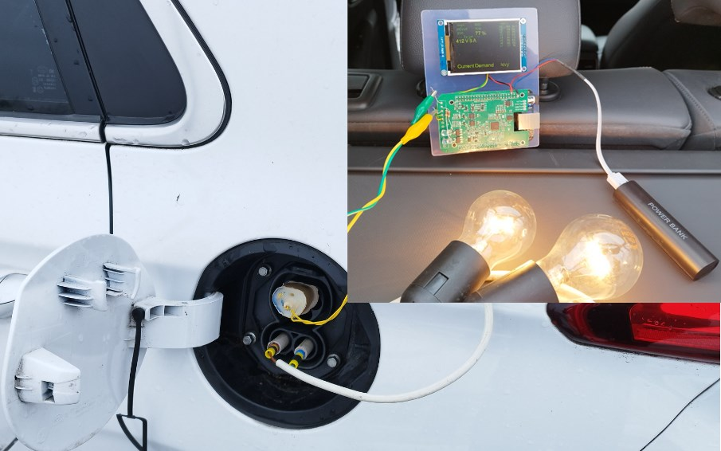
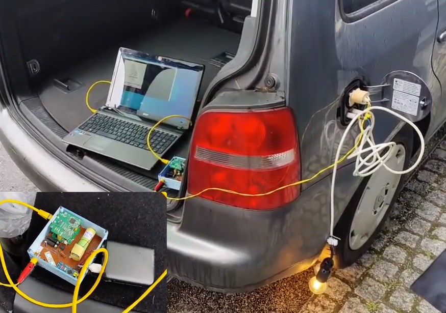

# DiDeBoCCS - The Discharge Demo Box for CCS

Demonstrator for discharging a car via CCS connector

## Version 1.1: BeagleBone with FoccciCape, HV supply and HV measurement

### Overview Block Diagram

### Detail Block Diagram of the HV StepUp converter

- DC fuses (10A, 1000VDC) are integrated in the CCS plug.
- Adjustable HV supply, consisting of a bunch of small DCDC converters, which are controlled in groups by 5 FETs.
- HV measurement using the muehlpower board
- supplied by two 18650 cells and a circuit board from a power bank to get 5V
- relay to connect/disconnect the bulbs

## Version 1: FoccciCape and BeagleBone

- Demonstration video on Touran https://youtu.be/jTx41aqIouk
- Demonstration video on Ioniq https://youtu.be/E4KNq4u5nmQ
- Detailled setup-guide [setup_focccicape.md](setup_focccicape.md)
- Discussion on openinverter forum https://openinverter.org/forum/viewtopic.php?p=87270#p87270
- Wiki on openinverter https://openinverter.org/wiki/FoccciCape

## Version 0: With Homeplug modem and Laptop

The test setup consists of
- notebook running pyPLC
- PLC modem
- arduino-based circuit which creates the 5% PWM on the control pilot
- two 230V light bulbs in series

Details can be found here:
- https://github.com/uhi22/pyPLC/blob/master/doc/EvseMode.md
- https://openinverter.org/forum/viewtopic.php?p=55942#p55942
- Demonstration video on Touran: https://www.youtube.com/watch?v=JHgeRtUz0qU
